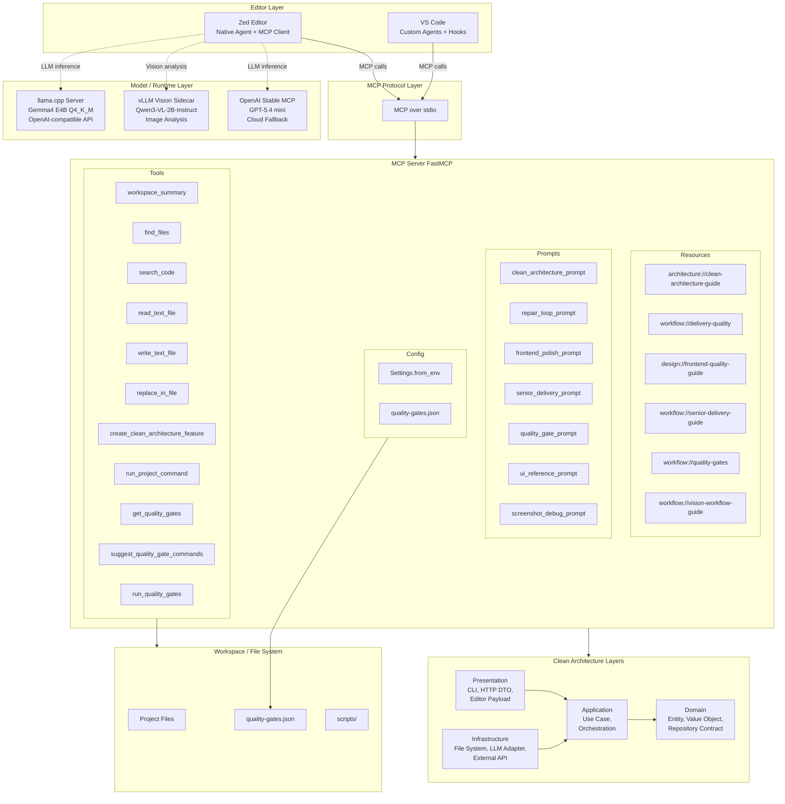
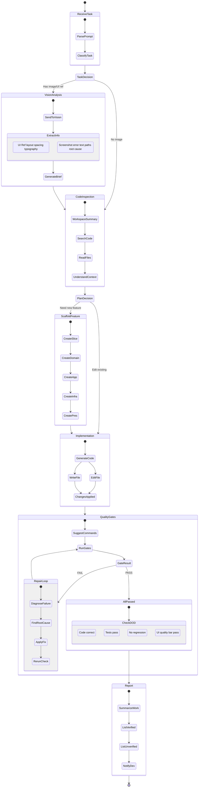

# Local Coding Agent for Zed and VS Code

โปรเจ็กต์นี้เป็นจุดเริ่มต้นสำหรับทำ local coding agent ที่:

- ใช้โมเดลจาก Hugging Face ผ่าน OpenAI-compatible endpoint
- ต่อกับ `Zed` และ `VS Code` ผ่าน `MCP`
- รู้จักโครงสร้าง workspace และช่วย scaffold งานแบบ clean architecture
- รันบน `macOS` และ `Pop!_OS` ได้โดยไม่ต้องพึ่ง cloud model

## แนวทางที่แนะนำกับเครื่องของคุณ

สเปก `Apple M2 + RAM 16GB` เหมาะกับแนวนี้:

- editor หลัก: `Zed`
- editor เสริมสำหรับ strict workflow: `VS Code`
- local model runtime: `llama.cpp`
- model เริ่มต้น: `ggml-org/gemma-4-E4B-it-GGUF`
- vision model เริ่มต้น: `Qwen/Qwen3-VL-2B-Instruct`
- quantization เริ่มต้น: `Q4_K_M`

เหตุผลคือแยกบทบาทชัดเจน:

- `llama.cpp` ทำหน้าที่เสิร์ฟโมเดลแบบ OpenAI-compatible
- `Zed` ใช้ endpoint นี้เป็น agent model
- MCP server ใน repo นี้ทำหน้าที่เป็น repo-aware tool layer
- optional vision sidecar ใช้ `vLLM` สำหรับรับรูป UI และ screenshot error
- `VS Code` ใช้ repo เดียวกันนี้ในโหมด strict ได้ผ่าน custom agents และ hooks

## โหมดที่แนะนำตอนนี้

ให้คิดเป็น 2 stack:

- `Gemma4 E4B Fast / Gemma4 E4B MCP Lite`
  ใช้ใน `Zed native agent` เพื่อคุย, สรุป, อ่านไฟล์, และทำ MCP แบบเบา
- `Stable MCP`
  ใช้ backend ที่รองรับ `tools + parallel_tool_calls + prompt_cache_key + /chat/completions` จริง แล้วต่อกับ `localCodingAgent` ตัวเดิมเพื่อทำ tool use จริง

สรุปตรง ๆ:

- ถ้าต้องการ `local ล้วน` และ `เบา` ให้ใช้ `Gemma4 E4B`
- ถ้าต้องการ `นิ่งกว่า` สำหรับ MCP/tool use จริง ให้ใช้ `OpenAI Stable MCP` เป็น backend หลักใน Zed แล้วใช้ MCP ตัวเดิม
- ถ้าต้องการใช้หลาย workspace ให้ติดตั้ง `local-coding-agent` แบบ global หนึ่งครั้ง แล้วให้แต่ละ workspace เรียก command นี้ได้เลย

ตอนนี้ใน repo มี provider เพิ่มให้แล้วชื่อ `OpenAI Stable MCP` ซึ่งชี้ไปที่ `https://api.openai.com/v1` และตั้ง capability ให้:

- `tools = true`
- `images = false`
- `parallel_tool_calls = true`
- `prompt_cache_key = true`
- `chat_completions = true`

โดยใช้ model เริ่มต้น `gpt-5.4-mini`

## สถานะตอนนี้แบบตรงไปตรงมา

ยังไม่ใช่ระดับ “ไร้ที่ติ” แต่เป็นฐานที่ใช้งานจริงและต่อยอดได้ดี

ข้อที่พร้อมแล้ว:

- local MCP server ทำงานได้
- มีกฎ test-first, repair loop, clean architecture, frontend quality, และ quality gates
- มี config สำหรับ Zed และ VS Code
- มี script setup, run model server, และ run MCP server

ข้อที่ยังเป็นข้อจำกัดจริง:

- คุณภาพการแก้โค้ดขึ้นกับโมเดลที่เลือกและคุณภาพ tool calling
- ยังไม่มี semantic index หรือ code graph ขั้นสูงแบบ editor proprietary บางตัว
- การวน loop แก้จนผ่านยังขึ้นกับ editor/model ทำตาม instructions ได้ดีแค่ไหน
- ความเร็วและ context จริงถูกจำกัดด้วย `llama.cpp` config และ VRAM ไม่ใช่แค่ตัวเลขบน model card

## Context ตอนนี้ได้มากแค่ไหน

ตัวโมเดล `Gemma4-E4B-it-GGUF` รองรับ context ระดับยาวมากตามตระกูล Gemma 4 E4B แต่ในโปรเจ็กต์นี้ค่าดีฟอลต์ของ local server ถูกตั้งไว้ที่ `16,384` ผ่าน `LLAMA_CONTEXT_SIZE=16384` เพื่อบาลานซ์ความนิ่งกับความเร็วบนเครื่อง local

สรุปแบบใช้งานจริง:

- model capability สูงสุด: สูงกว่าค่าที่เปิดใช้จริงในโปรเจ็กต์นี้
- default ในโปรเจ็กต์นี้: `16,384`
- ค่าที่แนะนำใน Zed สำหรับ `Gemma4 E4B MCP Lite`: `12,288`
- ถ้าต้องการตอบไวขึ้นสามารถลดเป็น `8,192` ได้
- ถ้าเครื่องไหวและยอมรับความช้าขึ้น สามารถเพิ่มเป็น `24,576` หรือ `32,768` ได้โดยปรับ `LLAMA_CONTEXT_SIZE`

ดังนั้นคำตอบคือ “รับ context ได้เยอะพอสมควรแล้ว” แต่ดีฟอลต์ยังไม่ได้เปิดสุด เพราะบนเครื่องคุณควรบาลานซ์ระหว่างความนิ่งกับความยาว context ก่อน

## จูน `Gemma4 E4B` ให้ดีที่สุดใน Zed

ถ้าจะใช้ `Gemma4 E4B` ต่อ ให้ตั้งแบบนี้:

- `LLAMA_CONTEXT_SIZE=16384`
- `LLAMA_REASONING=on`
- `LLAMA_TEMPERATURE=0.1`
- `LLAMA_TOP_P=0.9`
- `Gemma4 E4B Fast`
  ใช้คุย, สรุป, วางแผน, และงานที่ไม่ต้องเรียก tools
- `Gemma4 E4B MCP Lite`
  ใช้กับ MCP/tool use แบบเบาเท่านั้น

ข้อปฏิบัติที่ช่วยได้จริง:

- ใช้ `Ask` profile ก่อน `Write`
- อย่าสั่งหลายอย่างใน prompt เดียว
- ให้มันอ่านไฟล์หรือใช้ tool ทีละ step
- ถ้ามันเริ่มพ่น JSON tool call ดิบ ให้หยุด thread นั้นแล้วสลับไป stable stack ทันที

## คำสั่งติดตั้งแบบครบ

### 1. ติดตั้งแพ็กเกจระบบบน Pop!_OS

```bash
sudo apt update
sudo apt install -y \
  build-essential \
  ccache \
  cmake \
  curl \
  git \
  git-lfs \
  ninja-build \
  pkg-config \
  python3-dev \
  python3-pip \
  python3-venv
```

### 2. ติดตั้ง `uv`

```bash
curl -LsSf https://astral.sh/uv/install.sh | env UV_INSTALL_DIR="$HOME/.local/bin" sh
export PATH="$HOME/.local/bin:$PATH"
```

### 3. ติดตั้ง Hugging Face CLI

```bash
uv tool install hf
export PATH="$HOME/.local/bin:$PATH"
```

บน macOS ที่ติดตั้ง `uv` ผ่าน Homebrew คำสั่งมักอยู่ที่:

```bash
/opt/homebrew/bin/uv tool install hf
```

### 4. ติดตั้ง Zed บน Linux

```bash
curl -f https://zed.dev/install.sh | sh
```

### 5. ติดตั้ง dependencies ของ MCP server

```bash
uv --directory ./apps/agent-server sync --extra dev
```

ถ้าต้องการใช้ MCP server นี้กับ workspace อื่นด้วย ให้ติดตั้ง command แบบ global หนึ่งครั้ง:

```bash
bash ./scripts/install_global_agent.sh
```

จากนั้น editor ตัวอื่นหรือ workspace อื่นจะเรียก command ชื่อ `local-coding-agent` ได้เลย

ถ้าจะใช้ `OpenAI Stable MCP` ด้วย ให้ตั้ง API key หนึ่งครั้ง:

```bash
export OPENAI_STABLE_MCP_API_KEY="YOUR_OPENAI_API_KEY"
```

บน macOS ถ้าต้องการให้ใช้ได้ทุก terminal/session:

```bash
echo 'export OPENAI_STABLE_MCP_API_KEY="YOUR_OPENAI_API_KEY"' >> ~/.zshrc
source ~/.zshrc
```

ถ้าคุณอยากเริ่มงานใหม่บน `Desktop` แบบนิ่งกว่าการเปิด Zed เปล่า ๆ ให้ใช้คำสั่งเดียวนี้:

```bash
bash ./scripts/new_desktop_workspace.sh my-new-app
```

คำสั่งนี้จะ:

- สร้างโฟลเดอร์ `~/Desktop/my-new-app`
- bootstrap `.rules`, `AGENTS.md`, `.zed/settings.json`, `.vscode/mcp.json`
- พยายามเปิดโฟลเดอร์นั้นใน Zed ให้ทันที

ถ้าโฟลเดอร์มีอยู่แล้วและต้องการเขียนทับ config/template ให้ใช้:

```bash
bash ./scripts/new_desktop_workspace.sh --force my-new-app
```

### 6. ติดตั้ง VS Code เพิ่ม ถ้าต้องการโหมด strict workflow

```bash
sudo apt install -y code
```

### 7. ดาวน์โหลดโมเดลจาก Hugging Face

```bash
mkdir -p ./models
uvx --from huggingface_hub hf download ggml-org/gemma-4-E4B-it-GGUF \
  --include "gemma-4-E4B-it-Q4_K_M.gguf" \
  --local-dir ./models/Gemma4-E4B-it-GGUF
```

### 8. เตรียม `llama.cpp`

```bash
git clone https://github.com/ggml-org/llama.cpp.git ./vendor/llama.cpp
cmake -S ./vendor/llama.cpp -B ./vendor/llama.cpp/build -G Ninja -DGGML_CUDA=ON
cmake --build ./vendor/llama.cpp/build --config Release -j
```

ถ้า `nvcc --version` ยังไม่มี ให้ติดตั้ง CUDA toolkit ที่เข้ากับ driver ของเครื่องก่อน มิฉะนั้น `llama.cpp` จะถูก build แบบ CPU อย่างเดียว

### 9. ติดตั้ง vision sidecar แบบ optional

```bash
bash ./scripts/setup_vision_stack.sh
```

ถ้าคุณต้องการให้โมเดลรับรูป UI หรือ screenshot error ได้ ให้ใช้ขั้นนี้เพิ่ม

## โครงสร้าง

```text
.
├── .vscode/mcp.json
├── .vscode/settings.json
├── .zed/settings.json
├── .rules
├── AGENTS.md
├── quality-gates.json
├── apps/
│   ├── agent-server/
│   │   ├── pyproject.toml
│   │   ├── src/local_coding_agent/
│   │   └── tests/
│   └── vscode-extension/
├── docs/
│   ├── agent-behavior.md
│   ├── clean-architecture.md
│   ├── editor-setup.md
│   ├── quality-gates.md
│   └── vision-workflow.md
└── scripts/
    ├── run_agent_server.sh
    ├── run_llamacpp_server.sh
    ├── run_quality_gates.sh
    ├── run_vision_server.sh
    ├── run_vision_smoke_test.sh
    ├── run_vscode_hook.sh
    ├── setup_popos.sh
    └── setup_vision_stack.sh
```

## Quick Start

1. เตรียมเครื่อง Pop!_OS

```bash
bash ./scripts/setup_popos.sh
```

2. โหลด dependencies ของ MCP server

```bash
uv --directory ./apps/agent-server sync --extra dev
```

ถ้าต้องการปรับค่า environment เพิ่ม เช่น command allowlist หรือ model path ให้คัดลอก `.env.example` เป็น `.env`

3. ดาวน์โหลดโมเดล GGUF จาก Hugging Face

```bash
mkdir -p ./models
uvx --from huggingface_hub hf download ggml-org/gemma-4-E4B-it-GGUF \
  --include "gemma-4-E4B-it-Q4_K_M.gguf" \
  --local-dir ./models/Gemma4-E4B-it-GGUF
```

4. รัน local model server

```bash
LLAMA_CONTEXT_SIZE=16384 \
LLAMA_REASONING=on \
LLAMA_TEMPERATURE=0.1 \
MODEL_FILE=./models/Gemma4-E4B-it-GGUF/gemma-4-E4B-it-Q4_K_M.gguf \
bash ./scripts/run_llamacpp_server.sh
```

5. รัน MCP server

```bash
bash ./scripts/run_agent_server.sh
```

6. ถ้าจะใช้ backend ที่นิ่งกว่าสำหรับ MCP/tool use จริง ไม่ต้องรัน local model ก็ได้ แค่ตั้ง `OPENAI_STABLE_MCP_API_KEY` แล้วเลือก `GPT-5.4 mini Stable MCP` ใน Zed

6. ถ้าต้องการรับรูปภาพด้วย ให้รัน vision sidecar

```bash
bash ./scripts/run_vision_server.sh
```

จากนั้นลอง smoke test ด้วย:

```bash
bash ./scripts/run_vision_smoke_test.sh --image /path/to/reference-or-error.png
```

7. เปิด repo นี้ใน Zed หรือ VS Code

- Zed: ใช้ค่าจาก `.zed/settings.json` และเพิ่ม local model provider ตาม [docs/editor-setup.md](./docs/editor-setup.md)
- VS Code: ใช้ `.vscode/mcp.json` และ `.vscode/settings.json`

ถ้าจะใช้กับ workspace อื่น:

```bash
bash ./scripts/bootstrap_workspace.sh /absolute/path/to/other-workspace
```

คำสั่งนี้จะใส่ไฟล์ตั้งต้นให้ workspace ใหม่เพื่อให้ใช้ `local-coding-agent` ได้เหมือนกัน

ถ้า Zed แสดง `localCodingAgent` แต่เปิด server ไม่ขึ้น ให้ดู path ของ `uv` ก่อน:

```bash
command -v uv
```

แล้วเพิ่ม `UV_BIN` ใน MCP config ถ้าจำเป็น เช่น `/home/<user>/.local/bin/uv`

## MCP Server มีเครื่องมืออะไรบ้าง

- `workspace_summary` สรุป tree ของโปรเจ็กต์
- `find_files` หาไฟล์ตาม glob
- `search_code` ค้นโค้ดทั้ง repo
- `read_text_file` อ่านไฟล์แบบเจาะช่วงบรรทัด
- `write_text_file` สร้างหรือเขียนไฟล์ใหม่
- `replace_in_file` แก้โค้ดแบบตรงจุด
- `create_clean_architecture_feature` scaffold feature slice แบบ clean architecture
- `run_project_command` รันคำสั่งตรวจสอบที่อยู่ใน allowlist
- `get_quality_gates` อ่าน quality-gates ของ repo
- `suggest_quality_gate_commands` เลือก verification commands ตามไฟล์ที่แก้
- `run_quality_gates` รัน quality gates ตาม config กลาง

prompts/resources เพิ่มสำหรับ vision workflow:

- `workflow://vision-workflow-guide`
- `ui_reference_prompt`
- `screenshot_debug_prompt`

## Agent behavior ที่ฝังไว้ในโปรเจ็กต์

ผมเพิ่มกติกาสำหรับ agent แล้วเพื่อให้มีนิสัยแบบที่คุณต้องการ:

- `.rules` สำหรับ Zed
- `AGENTS.md` สำหรับ agent อื่น ๆ ที่อ่านไฟล์มาตรฐานนี้ได้
- `.github/copilot-instructions.md` สำหรับ VS Code
- `.github/instructions/testing.instructions.md` สำหรับ workflow แบบ test-first และ repair loop
- `.github/instructions/frontend.instructions.md` สำหรับงาน frontend
- `.github/prompts/*.prompt.md` สำหรับเรียกใช้งานเป็น prompt สำเร็จรูป

กติกาหลักคือ:

- ก่อนแก้ของที่มีผลกระทบ ต้องคิด verification step ก่อน
- ถ้า test fail ต้องย้อนกลับไปแก้ที่ root cause แล้ว rerun
- ห้ามแก้แบบลวก ๆ เช่นลด assertion, mute error, หรือซ่อนปัญหา
- งาน frontend ต้องนับ UX/UI เป็นส่วนหนึ่งของ definition of done
- ระหว่างงานหลายขั้น agent ควรรายงานความคืบหน้าสั้น ๆ ให้เห็นว่ากำลังทำอะไรอยู่
- ถ้าจะใช้ tool ต้องเรียกจริง ไม่พ่น JSON tool call ดิบออกมาในคำตอบ

นอกจากนี้ยังมี `quality-gates.json` เป็น source of truth สำหรับ verification commands ทั้ง Zed, VS Code, และ shell

## Clean Architecture ที่ server ใช้เป็น baseline

แต่ละ feature จะถูกแยกเป็น 4 ชั้น:

- `domain`
- `application`
- `infrastructure`
- `presentation`

รายละเอียดอยู่ที่ [docs/clean-architecture.md](./docs/clean-architecture.md)

มาตรฐาน workflow และ frontend เพิ่มเติม:

- [docs/agent-behavior.md](./docs/agent-behavior.md)
- [docs/frontend-standards.md](./docs/frontend-standards.md)
- [docs/quality-gates.md](./docs/quality-gates.md)
- [docs/vision-workflow.md](./docs/vision-workflow.md)

## งานที่ใช้ vision sidecar ได้ดี

- แนบภาพ UI ที่อยากได้ แล้วให้มันสรุป visual direction ก่อนลงมือเขียนโค้ด
- แนบ screenshot error หรือ broken layout แล้วให้มันอ่านข้อความและ state บนภาพ
- แนบ mockup แล้วให้มันสรุปเป็น build brief ส่งต่อให้ coder model

workflow ที่แนะนำ:

1. ใช้ vision model วิเคราะห์ภาพ
2. สรุปผลลัพธ์ออกมาเป็น build/debug brief
3. สลับกลับไป coder model
4. ให้ coder model ใช้ MCP tools และ quality gates ทำงานใน repo จริง

## หมายเหตุสำคัญ

- repo นี้ยังไม่สามารถรับประกันระดับ “ไร้ที่ติ” ได้ เพราะคุณภาพสุดท้ายยังขึ้นกับโมเดล, context, และ editor runtime
- เป้าหมายของ repo นี้คือทำ “local stack ที่ใช้ได้จริง” และเพิ่ม quality rails ให้พลาดยากขึ้น
- ถ้าต้องการ workflow เบาและตรง ให้เริ่มจาก `Zed`
- ถ้าต้องการ workflow เข้มพร้อม custom agents และ stop hooks ให้ใช้ `VS Code` กับไฟล์ที่เพิ่มไว้ใน repo นี้
- ถ้าต้องการ MCP/tool use ที่นิ่งกว่าการใช้ local `4B` ให้เก็บ MCP server ตัวเดิมไว้ แล้วเปลี่ยนไปใช้ agent/model ที่แรงกว่าเป็นตัวเรียก MCP แทน

---

## Architecture Diagrams

### 1. System Architecture Diagram

แสดงภาพรวมทั้งระบบ: Editor Layer, MCP Protocol, MCP Server (Resources, Prompts, Tools), Model/Runtime Layer, Clean Architecture Layers, File System

> รูป PNG: [`docs/diagrams/system_architecture.png`](./docs/diagrams/system_architecture.png)



---

### 2. Sequence Diagram

แสดง flow การทำงาน 6 phases: Task Understanding, Code Inspection, Implementation, Quality Gate + Repair Loop, Vision Workflow, Report

> รูป PNG: [`docs/diagrams/sequence_diagram.png`](./docs/diagrams/sequence_diagram.png)

```mermaid
sequenceDiagram
    autonumber
    actor Dev as Developer
    participant Editor as Editor Zed/VSCode
    participant MCP as MCP Server FastMCP
    participant LLM as llama.cpp Gemma4
    participant Vision as vLLM Sidecar Qwen3-VL
    participant FS as File System

    rect rgb(30, 41, 59)
    Note over Dev,FS: Phase 1 Task Understanding
    Dev->>Editor: send prompt
    Editor->>LLM: send prompt + context
    LLM-->>Editor: analyze + plan tool calls
    end

    rect rgb(30, 41, 59)
    Note over Dev,FS: Phase 2 Code Inspection
    Editor->>MCP: workspace_summary()
    MCP->>FS: read workspace tree
    FS-->>MCP: return tree structure
    MCP-->>Editor: return project structure

    Editor->>MCP: search_code(query)
    MCP->>FS: search files
    FS-->>MCP: return search results
    MCP-->>Editor: return matching code

    Editor->>MCP: read_text_file(path)
    MCP->>FS: read file
    FS-->>MCP: return file content
    MCP-->>Editor: return content + line numbers
    end

    rect rgb(30, 41, 59)
    Note over Dev,FS: Phase 3 Implementation
    Editor->>LLM: generate code from context
    LLM-->>Editor: return code changes

    alt New Feature
        Editor->>MCP: create_clean_architecture_feature(name)
        MCP->>FS: scaffold domain/app/infra/pres
        FS-->>MCP: confirm scaffold
        MCP-->>Editor: return created paths
    end

    Editor->>MCP: write_text_file(path, content)
    MCP->>FS: write new file
    FS-->>MCP: confirm write
    MCP-->>Editor: return success

    Editor->>MCP: replace_in_file(path, search, replace)
    MCP->>FS: edit code
    FS-->>MCP: confirm edit
    MCP-->>Editor: return success
    end

    rect rgb(30, 41, 59)
    Note over Dev,FS: Phase 4 Quality Gate Verification
    Editor->>MCP: suggest_quality_gate_commands(changed_paths)
    MCP->>FS: read quality-gates.json
    FS-->>MCP: return config
    MCP-->>Editor: return suggested commands

    loop Repair Loop until pass
        Editor->>MCP: run_quality_gates(changed_paths)
        MCP->>FS: run verification commands
        FS-->>MCP: return results pass/fail
        MCP-->>Editor: return gate results

        alt Gate Failed
            Editor->>LLM: analyze failure + find root cause
            LLM-->>Editor: return fix
            Editor->>MCP: replace_in_file(fix)
            MCP->>FS: apply fix
            FS-->>MCP: confirm
            MCP-->>Editor: return success
        end
    end
    end

    rect rgb(30, 41, 59)
    Note over Dev,FS: Phase 5 Vision Workflow Optional
    Dev->>Editor: attach screenshot / UI reference
    Editor->>Vision: analyze image
    Vision-->>Editor: return visual brief
    Editor->>LLM: implement from brief
    LLM-->>Editor: return implementation
    end

    rect rgb(30, 41, 59)
    Note over Dev,FS: Phase 6 Report
    Editor-->>Dev: summary + verification results
    end
```



---

### 3. Logic / State Diagram

แสดง state machine ของ agent: รับ task, ตัดสินใจ vision/code, implement, quality gates, repair loop, report

> รูป PNG: [`docs/diagrams/logic_state_diagram.png`](./docs/diagrams/logic_state_diagram.png)


