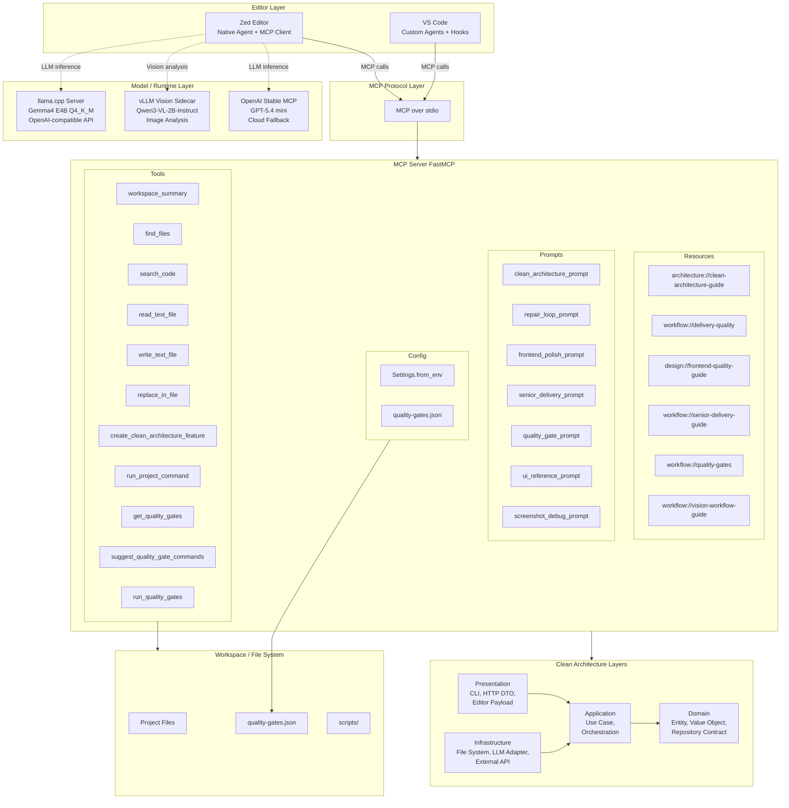
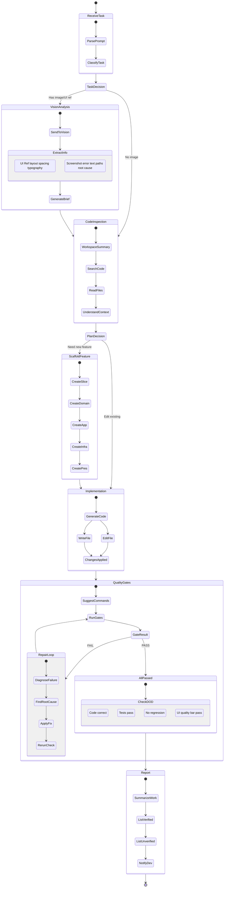

---

## Architecture Diagrams

### 1. System Architecture Diagram

แสดงภาพรวมทั้งระบบ: Editor Layer, MCP Protocol, MCP Server (Resources, Prompts, Tools), Model/Runtime Layer, Clean Architecture Layers, File System

> รูป PNG: [`docs/diagrams/system_architecture.png`](./docs/diagrams/system_architecture.png)

---

### 2. Sequence Diagram

แสดง flow การทำงาน 6 phases: Task Understanding, Code Inspection, Implementation, Quality Gate + Repair Loop, Vision Workflow, Report

> รูป PNG: [`docs/diagrams/sequence_diagram.png`](./docs/diagrams/sequence_diagram.png)

```mermaid
sequenceDiagram
    autonumber
    actor Dev as Developer
    participant Editor as Editor Zed/VSCode
    participant MCP as MCP Server FastMCP
    participant LLM as llama.cpp Gemma4
    participant Vision as vLLM Sidecar Qwen3-VL
    participant FS as File System

    rect rgb(30, 41, 59)
    Note over Dev,FS: Phase 1 Task Understanding
    Dev->>Editor: send prompt
    Editor->>LLM: send prompt + context
    LLM-->>Editor: analyze + plan tool calls
    end

    rect rgb(30, 41, 59)
    Note over Dev,FS: Phase 2 Code Inspection
    Editor->>MCP: workspace_summary()
    MCP->>FS: read workspace tree
    FS-->>MCP: return tree structure
    MCP-->>Editor: return project structure

    Editor->>MCP: search_code(query)
    MCP->>FS: search files
    FS-->>MCP: return search results
    MCP-->>Editor: return matching code

    Editor->>MCP: read_text_file(path)
    MCP->>FS: read file
    FS-->>MCP: return file content
    MCP-->>Editor: return content + line numbers
    end

    rect rgb(30, 41, 59)
    Note over Dev,FS: Phase 3 Implementation
    Editor->>LLM: generate code from context
    LLM-->>Editor: return code changes

    alt New Feature
        Editor->>MCP: create_clean_architecture_feature(name)
        MCP->>FS: scaffold domain/app/infra/pres
        FS-->>MCP: confirm scaffold
        MCP-->>Editor: return created paths
    end

    Editor->>MCP: write_text_file(path, content)
    MCP->>FS: write new file
    FS-->>MCP: confirm write
    MCP-->>Editor: return success

    Editor->>MCP: replace_in_file(path, search, replace)
    MCP->>FS: edit code
    FS-->>MCP: confirm edit
    MCP-->>Editor: return success
    end

    rect rgb(30, 41, 59)
    Note over Dev,FS: Phase 4 Quality Gate Verification
    Editor->>MCP: suggest_quality_gate_commands(changed_paths)
    MCP->>FS: read quality-gates.json
    FS-->>MCP: return config
    MCP-->>Editor: return suggested commands

    loop Repair Loop until pass
        Editor->>MCP: run_quality_gates(changed_paths)
        MCP->>FS: run verification commands
        FS-->>MCP: return results pass/fail
        MCP-->>Editor: return gate results

        alt Gate Failed
            Editor->>LLM: analyze failure + find root cause
            LLM-->>Editor: return fix
            Editor->>MCP: replace_in_file(fix)
            MCP->>FS: apply fix
            FS-->>MCP: confirm
            MCP-->>Editor: return success
        end
    end
    end

    rect rgb(30, 41, 59)
    Note over Dev,FS: Phase 5 Vision Workflow Optional
    Dev->>Editor: attach screenshot / UI reference
    Editor->>Vision: analyze image
    Vision-->>Editor: return visual brief
    Editor->>LLM: implement from brief
    LLM-->>Editor: return implementation
    end

    rect rgb(30, 41, 59)
    Note over Dev,FS: Phase 6 Report
    Editor-->>Dev: summary + verification results
    end
```

---

### 3. Logic / State Diagram

แสดง state machine ของ agent: รับ task, ตัดสินใจ vision/code, implement, quality gates, repair loop, report

> รูป PNG: [`docs/diagrams/logic_state_diagram.png`](./docs/diagrams/logic_state_diagram.png)

